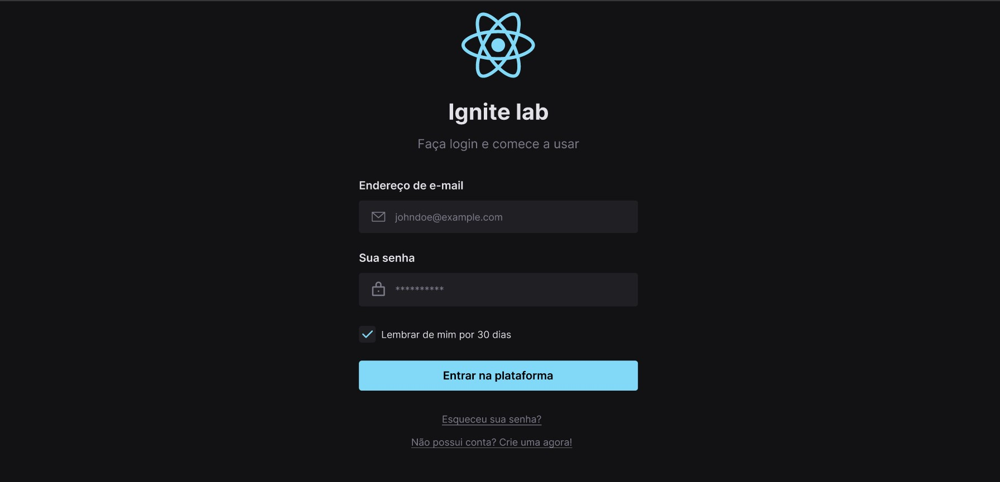
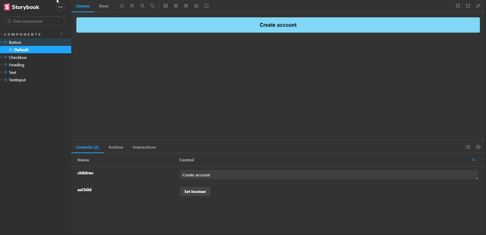
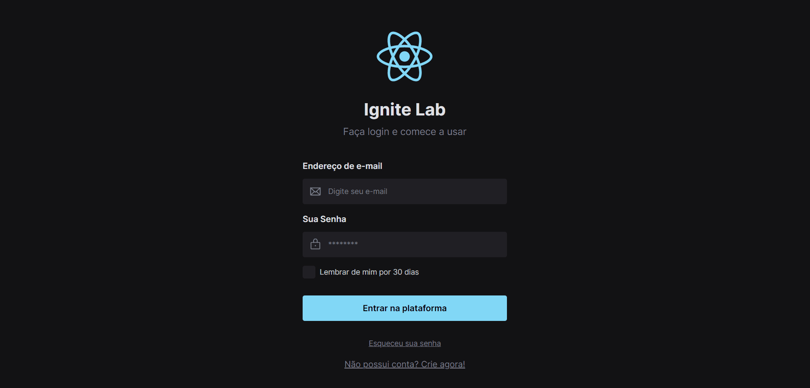

# Lab Design System

Projeto realizado junto com a Imersão Ignite Lab realizado pela galera da Rocketseat, o objetivo: Desenvolver um design system, que nada mais é do que padronizar os componentes, propriedades e regras
que são capazes de guiar o desenvolvimento de interfaces, o que ajuda no trabalho dos designers e dos 
desenvolvedores.

No processo utilizamos **Figma** para desenhar a interface, **Storybook** para criar um ambiente isolado dos componentes e
e suas variações, **ReactJS** para desenvolver a aplicação e TailWindCSS para poder estilizar os nossos componentes
criando classes customizadas.

# Interface no Figma

# Variação dos componentes no Storybook

# Web page ReactJS
